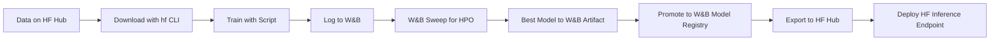

# MLOps: Model Registry & Experiment Tracking

Unified skill for managing ML models, tracking experiments, and interacting with model hubs. Covers two complementary tools:

1. **Weights & Biases** (`weights-and-biases`): Experiment tracking, hyperparameter sweeps, model registry, dashboards, team collaboration
2. **Hugging Face Hub CLI** (`huggingface-hub`): Search/download/upload models and datasets, manage repos, run SQL on datasets, manage Spaces and Inference Endpoints

Load this skill when the user wants to:
- Track ML experiments with metrics, artifacts, and visualizations
- Run hyperparameter sweeps (Bayesian, grid, random)
- Manage model versions and promote to production
- Search, download, and upload models/datasets on Hugging Face Hub
- Run SQL queries on dataset parquet files
- Manage Inference Endpoints and Spaces

---

## Quick Decision Guide

| Goal | Use This Section |
|------|------------------|
| Track experiments, compare runs, visualize metrics | [Weights & Biases](#weights--biases-wandb) |
| Run hyperparameter optimization sweeps | [W&B Sweeps](#hyperparameter-sweeps) |
| Version models, manage model registry | [W&B Artifacts & Model Registry](#artifacts--model-registry) |
| Search/download/upload HF models/datasets | [Hugging Face Hub CLI](#hugging-face-hub-cli-hf) |
| Run SQL on dataset parquet files | [HF Datasets SQL](#datasets--sql-queries) |
| Manage Inference Endpoints/Spaces | [HF Infrastructure](#infrastructure--compute) |
| Complete MLOps pipeline | [Integration Patterns](#integration-patterns) |

---

## Weights & Biases (W&B)

> **Source:** Absorbed from `weights-and-biases` skill. W&B: log ML experiments, sweeps, model registry, dashboards.

### When to Use
- Track ML experiments with automatic metric logging
- Visualize training in real-time dashboards
- Compare runs across hyperparameters and configurations
- Optimize hyperparameters with automated sweeps
- Manage model registry with versioning and lineage
- Collaborate on ML projects with team workspaces
- Track artifacts (datasets, models, code) with lineage

### Installation & Setup
```bash
pip install wandb
wandb login  # Creates API key at https://wandb.ai/authorize
# Or: export WANDB_API_KEY=your_api_key_here
```

### Quick Start: Basic Experiment Tracking
```python
import wandb

run = wandb.init(
    project="my-project",
    config={
        "learning_rate": 0.001,
        "epochs": 10,
        "batch_size": 32,
        "architecture": "ResNet50"
    }
)

for epoch in range(run.config.epochs):
    train_loss = train_epoch()
    val_loss = validate()
    
    wandb.log({
        "epoch": epoch,
        "train/loss": train_loss,
        "val/loss": val_loss,
        "train/accuracy": train_acc,
        "val/accuracy": val_acc
    })

wandb.finish()
```

### With PyTorch
```python
import torch
import wandb

wandb.init(project="pytorch-demo", config={"lr": 0.001, "epochs": 10})
config = wandb.config

for epoch in range(config.epochs):
    for batch_idx, (data, target) in enumerate(train_loader):
        output = model(data)
        loss = criterion(output, target)
        optimizer.zero_grad()
        loss.backward()
        optimizer.step()
        
        if batch_idx % 100 == 0:
            wandb.log({"loss": loss.item(), "epoch": epoch, "batch": batch_idx})

torch.save(model.state_dict(), "model.pth")
wandb.save("model.pth")  # Upload to W&B
wandb.finish()
```

### Core Concepts

#### Projects and Runs
```python
run = wandb.init(
    project="image-classification",
    name="resnet50-experiment-1",
    tags=["baseline", "resnet"],
    notes="First baseline run"
)
print(f"Run ID: {run.id}")
print(f"Run URL: {run.url}")
```

#### Configuration Tracking
```python
config = {
    "model": "ResNet50", "pretrained": True,
    "learning_rate": 0.001, "batch_size": 32, "epochs": 50,
    "optimizer": "Adam", "dataset": "ImageNet", "augmentation": "standard"
}
wandb.init(project="my-project", config=config)
lr = wandb.config.learning_rate
```

#### Metric Logging
```python
# Scalars
wandb.log({"loss": 0.5, "accuracy": 0.92})

# Multiple metrics with namespaces
wandb.log({
    "train/loss": train_loss, "train/accuracy": train_acc,
    "val/loss": val_loss, "val/accuracy": val_acc,
    "learning_rate": current_lr, "epoch": epoch
})

# Custom x-axis
wandb.log({"loss": loss}, step=global_step)

# Media: images, audio, video
wandb.log({"examples": [wandb.Image(img) for img in images]})

# Histograms
wandb.log({"gradients": wandb.Histogram(gradients)})

# Tables
table = wandb.Table(columns=["id", "prediction", "ground_truth"])
wandb.log({"predictions": table})
```

#### Model Checkpointing & Artifacts
```python
import torch

checkpoint = {
    'epoch': epoch,
    'model_state_dict': model.state_dict(),
    'optimizer_state_dict': optimizer.state_dict(),
    'loss': loss,
}
torch.save(checkpoint, 'checkpoint.pth')
wandb.save('checkpoint.pth')

# Artifacts (recommended)
artifact = wandb.Artifact('model', type='model')
artifact.add_file('checkpoint.pth')
wandb.log_artifact(artifact)
```

### Hyperparameter Sweeps

#### Define Sweep Configuration
```python
sweep_config = {
    'method': 'bayes',  # 'grid', 'random', 'bayes'
    'metric': {'name': 'val/accuracy', 'goal': 'maximize'},
    'parameters': {
        'learning_rate': {'distribution': 'log_uniform', 'min': 1e-5, 'max': 1e-1},
        'batch_size': {'values': [16, 32, 64, 128]},
        'optimizer': {'values': ['adam', 'sgd', 'rmsprop']},
        'dropout': {'distribution': 'uniform', 'min': 0.1, 'max': 0.5}
    }
}

sweep_id = wandb.sweep(sweep_config, project="my-project")
```

#### Define Training Function
```python
def train():
    run = wandb.init()
    lr = wandb.config.learning_rate
    batch_size = wandb.config.batch_size
    optimizer_name = wandb.config.optimizer
    
    model = build_model(wandb.config)
    optimizer = get_optimizer(optimizer_name, lr)
    
    for epoch in range(NUM_EPOCHS):
        train_loss = train_epoch(model, optimizer, batch_size)
        val_acc = validate(model)
        wandb.log({"train/loss": train_loss, "val/accuracy": val_acc})

wandb.agent(sweep_id, function=train, count=50)
```

#### Sweep Strategies
```python
# Grid search
sweep_config = {'method': 'grid', 'parameters': {'lr': {'values': [0.001, 0.01, 0.1]}}}

# Random search
sweep_config = {'method': 'random', 'parameters': {'lr': {'distribution': 'uniform', 'min': 0.0001, 'max': 0.1}}}

# Bayesian optimization (recommended)
sweep_config = {
    'method': 'bayes',
    'metric': {'name': 'val/loss', 'goal': 'minimize'},
    'parameters': {'lr': {'distribution': 'log_uniform', 'min': 1e-5, 'max': 1e-1}}
}
```

### Artifacts & Model Registry

#### Log Artifacts
```python
artifact = wandb.Artifact(
    name='training-dataset', type='dataset',
    description='ImageNet training split',
    metadata={'size': '1.2M images', 'split': 'train'}
)
artifact.add_file('data/train.csv')
artifact.add_dir('data/images/')
wandb.log_artifact(artifact)
```

#### Use Artifacts
```python
run = wandb.init(project="my-project")
artifact = run.use_artifact('training-dataset:latest')
artifact_dir = artifact.download()
data = load_data(f"{artifact_dir}/train.csv")
```

#### Model Registry
```python
model_artifact = wandb.Artifact(
    name='resnet50-model', type='model',
    metadata={'architecture': 'ResNet50', 'accuracy': 0.95}
)
model_artifact.add_file('model.pth')
wandb.log_artifact(model_artifact, aliases=['best', 'production'])
run.link_artifact(model_artifact, 'model-registry/production-models')
```

### Integration Examples

#### HuggingFace Transformers
```python
from transformers import Trainer, TrainingArguments
wandb.init(project="hf-transformers")
training_args = TrainingArguments(
    output_dir="./results", report_to="wandb",
    run_name="bert-finetuning", logging_steps=100
)
trainer = Trainer(model=model, args=training_args, train_dataset=train_dataset)
trainer.train()
```

#### PyTorch Lightning
```python
from pytorch_lightning import Trainer
from pytorch_lightning.loggers import WandbLogger

wandb_logger = WandbLogger(project="lightning-demo", log_model=True)
trainer = Trainer(logger=wandb_logger, max_epochs=10)
trainer.fit(model, datamodule=dm)
```

#### Keras/TensorFlow
```python
import wandb
from wandb.keras import WandbCallback
wandb.init(project="keras-demo")
model.fit(x_train, y_train, validation_data=(x_val, y_val), epochs=10, callbacks=[WandbCallback()])
```

### Best Practices

1. **Organize with Tags and Groups**
```python
wandb.init(project="my-project", tags=["baseline", "resnet50"], group="resnet-experiments", job_type="train")
```

2. **Log Everything Relevant**
```python
wandb.log({
    "gpu/util": gpu_utilization, "gpu/memory": gpu_memory_used,
    "git_commit": git_commit_hash,
    "data/train_size": len(train_dataset), "data/val_size": len(val_dataset)
})
```

3. **Use Descriptive Names**
```python
wandb.init(project="nlp-classification", name="bert-base-lr0.001-bs32-epoch10")
```

4. **Save Important Artifacts**
```python
artifact = wandb.Artifact('final-model', type='model')
artifact.add_file('model.pth')
wandb.log_artifact(artifact)

predictions_table = wandb.Table(columns=["id", "input", "prediction", "ground_truth"], data=predictions_data)
wandb.log({"predictions": predictions_table})
```

5. **Offline Mode for Unstable Connections**
```python
import os
os.environ["WANDB_MODE"] = "offline"
wandb.init(project="my-project")
# Later: wandb sync <run_directory>
```

### Team Collaboration
- Create team account at wandb.ai
- Add team members, set project visibility
- Use team-level artifacts and model registry

### Pricing
- **Free**: Unlimited public projects, 100GB storage
- **Academic**: Free for students/researchers
- **Teams**: $50/seat/month, private projects, unlimited storage
- **Enterprise**: Custom pricing, on-prem options

### References (from original skill)
- `references/sweeps.md` — Comprehensive hyperparameter optimization guide
- `references/artifacts.md` — Data and model versioning patterns
- `references/integrations.md` — Framework-specific examples

---

## Hugging Face Hub CLI (`hf`)

> **Source:** Absorbed from `huggingface-hub` skill. HuggingFace hf CLI: search/download/upload models, datasets.

### When to Use
- Search, download, upload models and datasets on Hugging Face Hub
- Manage repositories (create, delete, duplicate, move, branch, tag)
- Run SQL queries on dataset parquet files via DuckDB
- Manage Inference Endpoints, Jobs, Spaces
- Manage S3-like buckets, cache, webhooks, collections
- Handle discussions and pull requests on the Hub

### Installation
```bash
curl -LsSf https://hf.co/cli/install.sh | bash -
# Verify: hf --help
```

> **IMPORTANT:** The `hf` command replaces the deprecated `huggingface-cli`.

### Authentication
```bash
hf auth login  # Uses token from https://huggingface.co/settings/tokens
# Or: set HF_TOKEN env var or use --token flag
```

### Core Commands

#### General Operations
```bash
hf download REPO_ID                    # Download files from Hub
hf upload REPO_ID                      # Upload files/folders (single-commit)
hf upload-large-folder REPO_ID PATH    # Resumable uploads for large dirs
hf sync                                # Sync local dir with bucket
hf env / hf version                    # Environment and version info
```

#### Repository Management
```bash
hf repos create                        # Create repo (model/dataset/space)
hf repos delete                        # Permanently remove repo
hf repos duplicate                     # Clone to new ID
hf repos move                          # Transfer between namespaces
hf repos branch / hf repos tag         # Git-like references
hf repos delete-files                  # Remove specific files by pattern
```

#### Datasets & Models
```bash
hf datasets list / hf datasets info    # List or get dataset details
hf datasets sql "SELECT * FROM data"   # Raw SQL via DuckDB on parquet URLs
hf datasets parquet                    # List parquet URLs
hf models list / hf models info        # List or get model details
hf papers list                         # Daily papers
```

#### Discussions & Pull Requests
```bash
hf discussions list / create / info / comment / close / reopen / rename
hf discussions diff                    # View PR changes
hf discussions merge                   # Finalize PRs
```

#### Infrastructure & Compute
```bash
# Inference Endpoints
hf endpoints deploy / pause / resume / scale-to-zero / catalog

# Jobs (compute on HF infrastructure)
hf jobs uv                             # Run Python scripts with inline deps
hf jobs stats                          # Resource monitoring

# Spaces (interactive apps)
hf spaces dev-mode / hot-reload        # Python hot-reload without full restart
```

### Advanced Usage

#### Global Flags
```bash
hf download REPO_ID --format json     # Machine-readable output
hf models list -q                      # Quiet: IDs only
```

#### Search Patterns
```bash
# Search models
hf models list --search "llama" --filter "task=text-generation"
hf models list --sort downloads --limit 10
```

#### Large Folder Upload (Resumable)
```bash
hf upload-large-folder my-org/my-dataset ./local_data --num-workers 8
```

#### Buckets (S3-like)
```bash
hf buckets create my-bucket
hf buckets cp ./local_file s3://my-bucket/path/
hf buckets sync ./local_dir s3://my-bucket/path/
```

#### Cache Management
```bash
hf cache list                          # List cached repos
hf cache prune                         # Remove detached revisions
hf cache verify                        # Checksum verification
```

#### Webhooks
```bash
hf webhooks create --url https://my-webhook.com --events repo.push
hf webhooks list / enable / disable
```

### Common Workflows

#### Download Model for Local Inference
```bash
hf download meta-llama/Llama-3.1-8B-Instruct --include "*.safetensors" --local-dir ./models/llama3
```

#### Upload Fine-Tuned Model
```bash
hf upload my-org/my-finetuned-model ./output_model --commit-message "Add LoRA adapters"
```

#### Query Dataset with SQL
```bash
hf datasets sql "SELECT * FROM 'my-org/my-dataset' WHERE label = 'positive' LIMIT 100"
```

#### Deploy Inference Endpoint
```bash
hf endpoints deploy --repo my-org/my-model --instance-type gpu-small --min-replicas 1 --max-replicas 3
```

### Rate Limits
- **Gamma/General**: 4,000 req/10s
- **CLOB/General**: 9,000 req/10s
- **Data/General**: 1,000 req/10s

### Extensions & Skills
```bash
hf extensions install REPO_ID         # Extend CLI via GitHub repos
hf skills add                         # Manage AI assistant skills
```

---

## Integration Patterns

### Complete MLOps Pipeline


### W&B + HF Hub Sync
```python
# After training, save to both
# 1. W&B Artifact (for lineage, comparison)
artifact = wandb.Artifact('my-model', type='model')
artifact.add_dir('./model_output')
wandb.log_artifact(artifact, aliases=['best'])

# 2. Push to HF Hub (for serving, sharing)
from huggingface_hub import HfApi
api = HfApi()
api.upload_folder(
    folder_path="./model_output",
    repo_id="my-org/my-model",
    repo_type="model"
)
```

### Using HF Datasets in W&B
```python
# Download via hf CLI, then log as W&B artifact
# hf datasets download my-org/my-dataset --local-dir ./data
artifact = wandb.Artifact('my-dataset', type='dataset')
artifact.add_dir('./data')
wandb.log_artifact(artifact)
```

---

## Decision Matrix

| Task | Tool | Why |
|------|------|-----|
| **Track experiments, visualize, compare** | W&B | Real-time dashboards, sweep integration |
| **Hyperparameter optimization** | W&B Sweeps | Bayesian, grid, random with early stopping |
| **Model versioning + lineage** | W&B Artifacts | Git-like versioning, aliases, registry |
| **Search/download public models** | HF Hub CLI | Largest model repository, `hf download` |
| **Upload private fine-tunes** | HF Hub CLI | `hf upload`, `upload-large-folder` |
| **Run SQL on datasets** | HF `datasets sql` | DuckDB on parquet, no download needed |
| **Deploy inference API** | HF Endpoints | Managed, autoscaling, pay-per-use |
| **Team collaboration** | Both | W&B for experiments, HF for model hosting |

---

## Related Skills

- **`mlops-inference-serving`** — Deploy models from registry (llama.cpp, vLLM, HF Endpoints)
- **`mlops-training-finetuning`** — Train models that get tracked here (Unsloth, Axolotl, TRL)
- **`mlops-model-quantization`** — Quantize models before registry (GGUF, AWQ, GPTQ)
