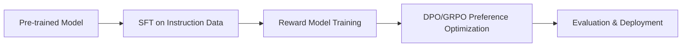

# MLOps: LLM Training & Fine-Tuning

Unified skill for fine-tuning and training LLMs. Covers three complementary approaches:

1. **Fast LoRA/QLoRA** (`unsloth`): 2-5x faster LoRA/QLoRA fine-tuning with less VRAM (Llama, Mistral, Gemma, Qwen)
2. **Comprehensive YAML-Based Training** (`axolotl`): Axolotl for LoRA/QLoRA, DPO, KTO, ORPO, GRPO, multimodal, DeepSpeed/FSDP
3. **RLHF/TRL Integration** (`trl`): SFT, DPO, PPO, GRPO, reward modeling via Hugging Face TRL library

Load this skill when the user wants to:
- Fine-tune LLMs with LoRA/QLoRA (fastest: Unsloth; most configurable: Axolotl)
- Run preference optimization (DPO, GRPO, KTO, ORPO)
- Train multimodal models
- Set up distributed training (DeepSpeed, FSDP, context parallelism)
- Build complete RLHF pipelines

---

## Quick Decision Guide

| Goal | Use This Section |
|------|------------------|
| Fastest LoRA/QLoRA on consumer GPU | [Fast LoRA/QLoRA (Unsloth)](#fast-loraqlora-unsloth) |
| Full-featured YAML configs, multimodal, DPO/GRPO | [YAML-Based Training (Axolotl)](#yaml-based-training-axolotl) |
| RLHF components, reward modeling, PPO | [RLHF with TRL](#rlhf-with-trl) |
| Distributed training (multi-GPU/node) | [Distributed Training](#distributed-training) |
| Complete pipeline: SFT → DPO → GRPO | [End-to-End Pipeline](#end-to-end-pipeline) |

---

## Fast LoRA/QLoRA (Unsloth)

> **Source:** Absorbed from `unsloth` skill. Unsloth: 2-5x faster LoRA/QLoRA fine-tuning, less VRAM.

### When to Use
- User wants fastest LoRA/QLoRA fine-tuning
- User has limited VRAM (consumer GPUs: 24GB, 16GB, even 8GB with QLoRA)
- User works with Llama, Mistral, Gemma, Qwen model families
- User needs 2-5x speedup over standard Hugging Face trainers

### Installation
```bash
# Standard (CUDA 12.1+)
pip install "unsloth[colab-new] @ git+https://github.com/unslothai/unsloth.git"

# For specific CUDA versions
pip install "unsloth[colab-new] @ git+https://github.com/unslothai/unsloth.git" --no-deps
pip install torch torchvision torchaudio --index-url https://download.pytorch.org/whl/cu121
```

### Quick Start
```python
from unsloth import FastLanguageModel
import torch

model, tokenizer = FastLanguageModel.from_pretrained(
    model_name="unsloth/llama-3-8b-bnb-4bit",  # 4-bit quantized
    max_seq_length=2048,
    dtype=None,  # Auto-detect
    load_in_4bit=True,
)

model = FastLanguageModel.get_peft_model(
    model,
    r=16,
    target_modules=["q_proj", "k_proj", "v_proj", "o_proj",
                    "gate_proj", "up_proj", "down_proj"],
    lora_alpha=16,
    lora_dropout=0,
    bias="none",
    use_gradient_checkpointing="unsloth",  # 30% more VRAM savings
    random_state=3407,
    use_rslora=False,
    loftq_config=None,
)

# Train
from trl import SFTTrainer
from datasets import load_dataset

dataset = load_dataset("mlabonne/FineTome-100k", split="train")

trainer = SFTTrainer(
    model=model,
    tokenizer=tokenizer,
    train_dataset=dataset,
    dataset_text_field="text",
    max_seq_length=2048,
    dataset_num_proc=2,
    packing=False,
    args=TrainingArguments(
        per_device_train_batch_size=2,
        gradient_accumulation_steps=4,
        warmup_steps=5,
        max_steps=60,
        learning_rate=2e-4,
        fp16=not torch.cuda.is_bf16_supported(),
        bf16=torch.cuda.is_bf16_supported(),
        logging_steps=1,
        optim="adamw_8bit",
        weight_decay=0.01,
        lr_scheduler_type="linear",
        seed=3407,
        output_dir="outputs",
    ),
)

trainer.train()
```

### Key Features

| Feature | Benefit |
|---------|---------|
| **2-5x faster** | Kernel fusion, optimized backprop |
| **Less VRAM** | Gradient checkpointing, 4-bit loading |
| **Long context** | Up to 128k+ with RoPE scaling |
| **Multi-GPU** | FSDP, DeepSpeed, DDP support |
| **Quantization aware** | QLoRA native, 4-bit NF4 |

### Supported Models
- **Llama**: 3.1, 3.2, 3.3 (1B-405B)
- **Mistral**: 7B, Nemo, NeMo, Mixtral
- **Gemma**: 2, 2B, 7B, 9B, 27B
- **Qwen**: 2.5, 3 (0.5B-72B)
- **Phi**: 3, 3.5, 4
- **CodeLlama**, **StarCoder**, **DeepSeek-Coder**

### Memory Requirements (QLoRA 4-bit)
| Model Size | Min VRAM | Recommended |
|------------|----------|-------------|
| 1B-3B | 6GB | 8GB |
| 7B-8B | 10GB | 16GB |
| 13B-14B | 16GB | 24GB |
| 30B-34B | 24GB | 48GB |
| 70B-72B | 48GB | 80GB (multi-GPU) |

### Common Patterns

#### Continue Training from Checkpoint
```python
model, tokenizer = FastLanguageModel.from_pretrained(
    model_name="./lora_model",
    max_seq_length=2048,
    dtype=None,
    load_in_4bit=True,
)
# Resume training...
```

#### Merge and Export
```python
# Merge LoRA weights
model.save_pretrained_merged("merged_model", tokenizer, save_method="merged_16bit")
# Or GGUF for llama.cpp
model.save_pretrained_gguf("gguf_model", tokenizer, quantization_method="q4_k_m")
```

#### Vision-Language Models
```python
from unsloth import FastVisionModel
model, tokenizer = FastVisionModel.from_pretrained(
    "unsloth/llava-1.5-7b-hf",
    load_in_4bit=True,
)
```

### References (from original skill)
- `references/llms.md` — Core documentation
- `references/llms-full.md` — Extended documentation
- `references/llms-txt.md` — LLM-friendly format

---

## YAML-Based Training (Axolotl)

> **Source:** Absorbed from `axolotl` skill. Axolotl: YAML LLM fine-tuning (LoRA, DPO, GRPO).

### When to Use
- User wants comprehensive YAML-based configuration
- User needs multimodal training support
- User requires DPO, KTO, ORPO, GRPO preference optimization
- User needs DeepSpeed, FSDP, context parallelism
- User wants 100+ model support with unified config format

### Installation
```bash
pip install axolotl
# Or with all extras
pip install "axolotl[all]"
```

### Quick Start
```bash
# Train from YAML config
accelerate launch -m axolotl.cli.train examples/llama-3/lora-8b.yml
```

### Core Configuration (YAML)

#### Base Model & LoRA
```yaml
base_model: meta-llama/Meta-Llama-3-8B
model_type: LlamaForCausalLM
tokenizer_type: AutoTokenizer

# LoRA config
adapter: lora
lora_r: 16
lora_alpha: 32
lora_dropout: 0.05
lora_target_modules:
  - q_proj
  - k_proj
  - v_proj
  - o_proj
  - gate_proj
  - up_proj
  - down_proj
```

#### QLoRA (4-bit)
```yaml
load_in_4bit: true
bnb_4bit_quant_type: nf4
bnb_4bit_compute_dtype: bfloat16
bnb_4bit_use_double_quant: true
```

#### DPO Preference Optimization
```yaml
rl: dpo
dpo_config:
  beta: 0.1
  label_smoothing: 0.0
  loss_type: sigmoid
  generate_during_eval: false
```

#### GRPO (Group Relative Policy Optimization)
```yaml
rl: grpo
grpo_config:
  beta: 0.04
  epsilon: 0.2
  num_generations: 8
  max_completion_length: 1024
```

#### KTO (Kahneman-Tversky Optimization)
```yaml
rl: kto
kto_config:
  beta: 0.1
  desirable_weight: 1.0
  undesirable_weight: 1.0
```

#### Dataset Formats
```yaml
datasets:
  - path: mlabonne/FineTome-100k
    type: chat_template
    conversation_field: messages
  - path: ./custom_data.json
    type: completion
    field: text

# For DPO/GRPO/KTO
datasets:
  - path: argilla/ultrafeedback-binarized-preferences-cleaned
    type: preference
    chosen_field: chosen
    rejected_field: rejected
```

#### Distributed Training

**DeepSpeed ZeRO-3:**
```yaml
deepspeed: configs/deepspeed/zero3.json
deepspeed_args:
  offload_optimizer_device: none
  offload_param_device: none
```

**FSDP:**
```yaml
fsdp_version: 2
fsdp_config:
  offload_params: true
  state_dict_type: FULL_STATE_DICT
  auto_wrap_policy: TRANSFORMER_BASED_WRAP
  transformer_layer_cls_to_wrap: LlamaDecoderLayer
  reshard_after_forward: true
```

**Context Parallelism:**
```yaml
context_parallel_size: 4  # Must divide total GPUs
# With 8 GPUs and cp=4: 2 batches per step (each split across 4 GPUs)
```

#### Multimodal Training
```yaml
model_type: LlavaForConditionalGeneration
# Or for Qwen2-VL, etc.
datasets:
  - path: lmms-lab/LLaVA-OneVision-Data
    type: vision_language
    conversation_field: conversations
    image_field: image
```

#### Save Compressed (vLLM Compatible)
```yaml
save_compressed: true  # ~40% disk savings, vLLM compatible
```

### Common Patterns

#### Validate Data Transfer Speeds (NCCL)
```bash
./build/all_reduce_perf -b 8 -e 128M -f 2 -g 3
```

#### Drop Long Sequences
```python
from axolotl.utils.trainer import drop_long_seq
drop_long_seq(sample, sequence_len=2048, min_sequence_len=2)
```

#### Integration with Custom Models
```yaml
integrations:
  - my_custom_integration  # Any installed package
```

### References (from original skill)
- `references/api.md` — API documentation
- `references/dataset-formats.md` — Dataset format specifications
- `references/other.md` — Additional documentation

---

## RLHF with TRL

> **Note:** The `fine-tuning-with-trl` skill was referenced but not found. This section covers TRL (Transformer Reinforcement Learning) for SFT, DPO, PPO, GRPO, and reward modeling.

### When to Use
- User wants to build RLHF pipelines from scratch
- User needs custom reward models
- User wants PPO/GRPO with vLLM backend for speed
- User needs integration with Hugging Face ecosystem

### Installation
```bash
pip install trl[peft,accelerate]
```

### SFT (Supervised Fine-Tuning)
```python
from trl import SFTTrainer
from transformers import TrainingArguments

trainer = SFTTrainer(
    model=model,
    args=TrainingArguments(...),
    train_dataset=dataset,
    dataset_text_field="text",
    max_seq_length=2048,
    packing=True,
)
```

### DPO (Direct Preference Optimization)
```python
from trl import DPOTrainer

trainer = DPOTrainer(
    model=model,
    ref_model=ref_model,
    args=TrainingArguments(...),
    train_dataset=preference_dataset,
    beta=0.1,
    max_length=1024,
    max_prompt_length=512,
)
```

### PPO (Proximal Policy Optimization)
```python
from trl import PPOTrainer, PPOConfig

config = PPOConfig(
    batch_size=16,
    mini_batch_size=4,
    learning_rate=1e-5,
)

trainer = PPOTrainer(
    config=config,
    model=model,
    ref_model=ref_model,
    tokenizer=tokenizer,
    dataset=dataset,
)

# Generation + reward + PPO step
generation = trainer.generate(queries, **gen_kwargs)
rewards = reward_model(generation)
trainer.step(queries, generation, rewards)
```

### GRPO (Group Relative Policy Optimization)
```python
from trl import GRPOTrainer

trainer = GRPOTrainer(
    model=model,
    args=GRPOConfig(
        num_generations=8,
        max_completion_length=1024,
        beta=0.04,
    ),
    train_dataset=dataset,
    reward_funcs=[reward_func1, reward_func2],
)
```

### Reward Modeling
```python
from trl import RewardTrainer

trainer = RewardTrainer(
    model=model,
    args=TrainingArguments(...),
    train_dataset=preference_dataset,
    max_length=512,
)
```

### vLLM Backend for Fast Generation
```python
from trl import GRPOConfig

config = GRPOConfig(
    use_vllm=True,
    vllm_mode="colocate",  # or "server"
    vllm_gpu_memory_utilization=0.8,
)
```

---

## Distributed Training

### Framework Comparison

| Framework | Best For | Complexity |
|-----------|----------|------------|
| **DeepSpeed ZeRO-3** | Large models (>30B), memory constrained | Medium |
| **FSDP2** | Native PyTorch, flexible sharding | Medium |
| **Context Parallel** | Long sequences (>32k), multi-GPU | High |
| **Tensor Parallel** | Single model across GPUs (Megatron) | High |
| **Pipeline Parallel** | Very large models, memory bound | High |

### DeepSpeed ZeRO-3 Config (Reference)
```json
{
  "zero_optimization": {
    "stage": 3,
    "offload_param": {"device": "cpu", "pin_memory": true},
    "offload_optimizer": {"device": "cpu", "pin_memory": true},
    "overlap_comm": true,
    "contiguous_gradients": true,
    "sub_group_size": 1e9,
    "stage3_max_live_parameters": 1e9,
    "stage3_max_reuse_distance": 1e9,
    "stage3_param_persistence_threshold": 10000
  },
  "bf16": {"enabled": true},
  "gradient_clipping": 1.0
}
```

### FSDP2 Config (Axolotl)
```yaml
fsdp_version: 2
fsdp_config:
  offload_params: true
  state_dict_type: FULL_STATE_DICT
  auto_wrap_policy: TRANSFORMER_BASED_WRAP
  transformer_layer_cls_to_wrap: LlamaDecoderLayer
  reshard_after_forward: true
  backward_prefetch: BACKWARD_PRE
  mixed_precision: bfloat16
```

### Context Parallelism (Ring Attention)
```yaml
context_parallel_size: 4
# 8 GPUs → 2 micro-batches, each split across 4 GPUs
# sequence_len effectively multiplied by CP size
```

---

## End-to-End Pipeline

### Typical RLHF Flow


### Complete Example: Llama-3-8B → Chat Model

**1. SFT Stage (Unsloth for speed):**
```python
# unsloth_sft.py
model, tokenizer = FastLanguageModel.from_pretrained(
    "unsloth/llama-3-8b-bnb-4bit", max_seq_length=4096, load_in_4bit=True
)
model = FastLanguageModel.get_peft_model(model, r=16, target_modules=...)
trainer = SFTTrainer(model=model, train_dataset=sft_data, ...)
trainer.train()
model.save_pretrained("llama-3-8b-sft")
```

**2. Reward Model (Axolotl):**
```yaml
# reward_model.yml
base_model: ./llama-3-8b-sft
rl: reward_model
datasets:
  - path: preference_data
    type: preference
```

**3. DPO/GRPO (Axolotl or TRL):**
```yaml
# dpo.yml
base_model: ./llama-3-8b-sft
rl: dpo
dpo_config:
  beta: 0.1
```

**4. Merge & Deploy:**
```python
model.save_pretrained_merged("llama-3-8b-chat", tokenizer, "merged_16bit")
# Or GGUF
model.save_pretrained_gguf("llama-3-8b-chat-gguf", tokenizer, "q4_k_m")
```

---

## Audio & Music Model Fine-Tuning

When fine-tuning audio/music generation models (e.g., AceStep 4B, HeartMuLa 3B), adapt the standard LLM pipeline with these Hermes-native patterns:

- **Hermes-Native Pipeline Preference**: Prioritize built-in skills over ad-hoc external tooling. Use `research-knowledge-retrieval` (YouTube transcript extraction) to auto-generate rich text captions from video metadata, replacing manual dataset labeling.
- **Hardware Reality**: A 4B parameter audio model requires ~12-16GB VRAM minimum for LoRA with `bf16` + gradient checkpointing. A 2x RTX 3090 (24GB each) setup can comfortably handle this. If VRAM is tighter, use QLoRA (`load_in_4bit=True`).
- **Custom Data Collator**: Unlike text LLMs, audio models require a custom `DataCollator` to convert WAV/MP3 file paths into mel-spectrograms or audio tokens before passing to the `Trainer`. Reference the `ai-music-generation` skill for model-specific architecture details.

## Decision Matrix

| Scenario | Tool | Why |
|----------|------|-----|
| **Consumer GPU (8-24GB), fastest LoRA** | Unsloth | 2-5x speed, lowest VRAM |
| **Complex configs, multimodal, DPO/GRPO** | Axolotl | 100+ models, YAML, all RL algos |
| **Custom RLHF pipeline, research** | TRL | Full control, vLLM backend, reward modeling |
| **Multi-GPU, >30B models** | Axolotl + DeepSpeed/FSDP | Best distributed support |
| **Production deployment** | Unsloth → GGUF → llama.cpp | End-to-end quantization |
| **Quick experiments** | Unsloth | Minimal boilerplate |

---

## Related Skills

- **`mlops-inference-serving`** — Deploy fine-tuned models (llama.cpp, vLLM)
- **`mlops-model-registry-tracking`** — Track experiments (W&B), manage models (HF Hub)
- **`mlops-model-quantization`** — Post-training quantization (GGUF, AWQ, GPTQ)
