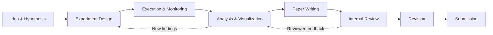
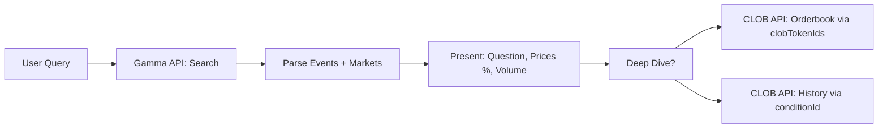
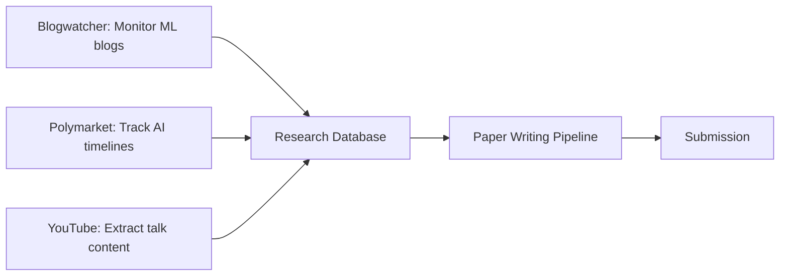

# Research, Knowledge Retrieval & Content Monitoring

Unified skill for research workflows, content monitoring, and knowledge extraction. Covers four complementary domains:

1. **Blog & Feed Monitoring** (`blogwatcher`): Track RSS/Atom feeds, auto-discover feeds, HTML scraping fallback, OPML import
2. **ML Paper Writing Pipeline** (`research-paper-writing`): End-to-end pipeline for NeurIPS/ICML/ICLR papers: design→experiments→analysis→writing→review→submit
3. **Prediction Market Data** (`polymarket`): Query Polymarket via public REST APIs for market prices, orderbooks, history
4. **YouTube Content Extraction** (`youtube-content`): Extract transcripts, convert to summaries/threads/blogs/chapters

Load this skill when the user wants to:
- Monitor blogs and RSS feeds for updates
- Write and submit ML research papers
- Query prediction market odds and data
- Extract and repurpose YouTube video content
- Build research pipelines combining multiple sources

---

## Quick Decision Guide

| Goal | Use This Section |
|------|------------------|
| Monitor blogs/RSS feeds for new posts | [Blog & Feed Monitoring](#blog--feed-monitoring-blogwatcher) |
| Write ML paper for top conference | [ML Paper Writing Pipeline](#ml-paper-writing-pipeline) |
| Get prediction market odds | [Prediction Market Data (Polymarket)](#prediction-market-data-polymarket) |
| Extract YouTube transcripts/summaries | [YouTube Content Extraction](#youtube-content-extraction) |
| Research workflow: monitor → analyze → write | [Integrated Research Workflow](#integrated-research-workflow) |

---

## Blog & Feed Monitoring (blogwatcher)

> **Source:** Absorbed from `blogwatcher` skill. Monitor blogs and RSS/Atom feeds via blogwatcher-cli tool.

### When to Use
- Track specific blogs for new posts
- Monitor RSS/Atom feeds automatically
- Import feeds from OPML (Feedly, Inoreader, NewsBlur)
- Filter articles by category or blog
- Manage read/unread state

### Installation
```bash
# Go
go install github.com/JulienTant/blogwatcher-cli/cmd/blogwatcher-cli@latest

# Docker
docker run --rm -v blogwatcher-cli:/data ghcr.io/julientant/blogwatcher-cli scan

# Binary (Linux/macOS)
curl -sL https://github.com/JulienTant/blogwatcher-cli/releases/latest/download/blogwatcher-cli_linux_amd64.tar.gz | tar xz -C /usr/local/bin blogwatcher-cli
```

**Docker with persistent storage:**
```bash
docker run --rm -v blogwatcher-cli:/data -e BLOGWATCHER_DB=/data/blogwatcher-cli.db ghcr.io/julientant/blogwatcher-cli scan
```

### Common Commands

#### Managing Blogs
```bash
# Add a blog (auto-discovers feed)
blogwatcher-cli add "My Blog" https://example.com

# Add with explicit feed
blogwatcher-cli add "My Blog" https://example.com --feed-url https://example.com/feed.xml

# Add with HTML scraping fallback
blogwatcher-cli add "My Blog" https://example.com --scrape-selector "article h2 a"

# List tracked blogs
blogwatcher-cli blogs

# Remove a blog
blogwatcher-cli remove "My Blog" --yes

# Import from OPML
blogwatcher-cli import subscriptions.opml
```

#### Scanning and Reading
```bash
# Scan all blogs
blogwatcher-cli scan

# Scan one blog
blogwatcher-cli scan "My Blog"

# List unread articles
blogwatcher-cli articles

# List all articles
blogwatcher-cli articles --all

# Filter by blog
blogwatcher-cli articles --blog "My Blog"

# Filter by category
blogwatcher-cli articles --category "Engineering"

# Mark article read/unread
blogwatcher-cli read 1
blogwatcher-cli unread 1

# Mark all read
blogwatcher-cli read-all
blogwatcher-cli read-all --blog "My Blog" --yes
```

### Environment Variables
| Variable | Description |
|----------|-------------|
| `BLOGWATCHER_DB` | SQLite database path (default: `~/.blogwatcher-cli/blogwatcher-cli.db`) |
| `BLOGWATCHER_WORKERS` | Concurrent scan workers (default: 8) |
| `BLOGWATCHER_SILENT` | Only output "scan done" when scanning |
| `BLOGWATCHER_YES` | Skip confirmation prompts |
| `BLOGWATCHER_CATEGORY` | Default category filter |

### Example Output
```bash
$ blogwatcher-cli blogs
Tracked blogs (1):
  xkcd
    URL: https://xkcd.com
    Feed: https://xkcd.com/atom.xml
    Last scanned: 2026-04-03 10:30

$ blogwatcher-cli scan
Scanning 1 blog(s)...
  xkcd
    Source: RSS | Found: 4 | New: 4
Found 4 new article(s) total!

$ blogwatcher-cli articles
Unread articles (2):
  [1] [new] Barrel - Part 13
       Blog: xkcd | URL: https://xkcd.com/3095/
       Published: 2026-04-02 | Categories: Comics, Science
```

### Notes
- Auto-discovers RSS/Atom feeds from blog homepages
- Falls back to HTML scraping if RSS fails (with `--scrape-selector`)
- Categories from feeds are stored and filterable
- Database at `~/.blogwatcher-cli/blogwatcher-cli.db` (override with `--db` or `BLOGWATCHER_DB`)

---

## ML Paper Writing Pipeline (research-paper-writing)

> **Source:** Absorbed from `research-paper-writing` skill. Write ML papers for NeurIPS/ICML/ICLR: design→submit.

### When to Use
- Target: NeurIPS, ICML, ICLR, ACL, AAAI, COLM
- Full research lifecycle: experiment design → execution → analysis → writing → review → revision → submission
- Iterative loop: results trigger new experiments, reviews trigger new analysis

### Pipeline Overview


### Phase 1: Experiment Design
- Define research question, hypothesis, success criteria
- Design controlled experiments with baselines and ablations
- Plan compute budget, timeline, milestones
- **Output:** `experiment_design.md` with hypothesis, variables, metrics, baselines

### Phase 2: Execution & Monitoring
- Set up reproducible training (seeds, configs, environment capture)
- Launch experiments with monitoring (W&B, TensorBoard, custom dashboards)
- Detect failures early (NaN loss, divergence, hardware issues)
- Log all artifacts: configs, checkpoints, logs, metrics
- **Output:** Experiment artifacts in organized structure

### Phase 3: Analysis & Visualization
- Statistical rigor: confidence intervals, significance tests, multiple seeds
- Create publication-ready figures (matplotlib, seaborn, SciencePlots)
- Ablation studies, scaling laws, qualitative analysis
- Failure mode analysis, limitations
- **Output:** `analysis/` directory with figures, tables, statistical reports

### Phase 4: Paper Writing
- Structure: Abstract → Intro → Related Work → Method → Experiments → Discussion → Conclusion
- LaTeX with conference template (NeurIPS/ICML/ICLR style files)
- Cite properly: Semantic Scholar, arXiv, Crossref integration
- **Output:** `paper/main.tex` + supplementary materials

### Phase 5: Review & Revision
- Internal review checklist (clarity, correctness, reproducibility, ethics)
- Simulated review: LLM-as-reviewer for common issues
- Address feedback systematically
- **Output:** `reviews/` with responses, `paper/main_revised.tex`

### Phase 6: Submission
- Generate PDF, check page limits, supplementary format
- Create submission package (pdf, zip, CMT/OpenReview metadata)
- **Output:** Final submission files

### Key Tools & Dependencies
```bash
# Core
pip install semanticscholar arxiv habanero requests scipy numpy matplotlib SciencePlots

# Paper writing
# LaTeX: texlive-full (Linux) / MacTeX (macOS)
```

### Workflow Commands (via terminal)
```bash
# Literature search
semanticscholar search "transformer interpretability" --limit 20
arxiv download 2305.12345

# Experiment tracking
wandb init --project my-paper
wandb sweep sweep_config.yaml

# Figure generation
python scripts/generate_figures.py --output paper/figures/

# Paper compilation
latexmk -pdf paper/main.tex
```

### Best Practices
1. **Reproducibility:** Log seeds, exact configs, environment (conda/pip freeze)
2. **Statistical rigor:** Multiple seeds (5+), confidence intervals, significance tests
3. **Version control:** Git for code, DVC for data, W&B for experiments
4. **Writing hygiene:** One idea per paragraph, active voice, concrete claims
5. **Review process:** Self-review → co-author review → simulated LLM review → submit

### Related Skills
- **`mlops-model-registry-tracking`** — W&B for experiment tracking
- **`mlops-training-finetuning`** — Training infrastructure (Axolotl, Unsloth)
- **`mlops-inference-serving`** — Inference for evaluation

---

## Prediction Market Data (Polymarket)

> **Source:** Absorbed from `polymarket` skill. Query Polymarket: markets, prices, orderbooks, history.

### When to Use
- User asks about prediction markets, betting odds, event probabilities
- User wants to know "what are the odds of X happening?"
- User wants market prices, orderbook data, or price history
- User wants to monitor/track prediction market movements

### Key Concepts
- **Events** contain one or more **Markets** (1:many)
- **Markets** are binary outcomes with Yes/No prices (0.00–1.00)
- **Prices ARE probabilities**: price 0.65 = 65% likely
- `outcomePrices`: JSON array like `["0.80", "0.20"]`
- `clobTokenIds`: JSON array of two token IDs [Yes, No]
- `conditionId`: hex string for price history queries
- Volume in USDC (US dollars)

### Three Public APIs
1. **Gamma API** (`gamma-api.polymarket.com`) — Discovery, search, browsing
2. **CLOB API** (`clob.polymarket.com`) — Real-time prices, orderbooks, history
3. **Data API** (`data-api.polymarket.com`) — Trades, open interest

### Typical Workflow


### Presenting Results
```bash
# Format prices as percentages
# outcomePrices ["0.652", "0.348"] → "Yes: 65.2%, No: 34.8%"
# Always show market question and probability
# Include volume when available

Example: "Will X happen? — 65.2% Yes ($1.2M volume)"
```

### Parsing Double-Encoded Fields
```python
import json
# Gamma API returns outcomePrices, outcomes, clobTokenIds as JSON strings inside JSON
prices = json.loads(market['outcomePrices'])  # Get actual array
```

### Key Endpoints (see `references/api-endpoints.md` for full reference)

#### Search Markets (Gamma)
```bash
curl "https://gamma-api.polymarket.com/markets?query=ethereum&limit=10"
```

#### Get Market Prices (CLOB)
```bash
curl "https://clob.polymarket.com/prices?token_ids=[TOKEN_YES,TOKEN_NO]"
```

#### Price History (CLOB)
```bash
curl "https://clob.polymarket.com/prices-history?condition_id=CONDITION_ID&fidelity=1h"
```

### Rate Limits (generous)
- Gamma: 4,000 req/10s
- CLOB: 9,000 req/10s
- Data: 1,000 req/10s

### Limitations
- Read-only — no trade placement (requires wallet crypto auth)
- Some new markets may have empty price history
- Geographic restrictions apply to trading (not read-only data)

### References
- `references/api-endpoints.md` — Full endpoint reference with curl examples
- `scripts/polymarket.py` — Python helper script

---

## YouTube Content Extraction (youtube-content)

> **Source:** Absorbed from `youtube-content` skill. YouTube transcripts to summaries, threads, blogs.

### When to Use
- User shares YouTube URL or video link
- User asks to summarize a video
- User requests transcript extraction
- User wants to reformat video content (chapters, threads, blog posts)

### Setup
```bash
pip install youtube-transcript-api
```

### Helper Script
```bash
# JSON output with metadata
python3 SKILL_DIR/scripts/fetch_transcript.py "https://youtube.com/watch?v=VIDEO_ID"

# Plain text (for piping)
python3 SKILL_DIR/scripts/fetch_transcript.py "URL" --text-only

# With timestamps
python3 SKILL_DIR/scripts/fetch_transcript.py "URL" --timestamps

# Specific language with fallback
python3 SKILL_DIR/scripts/fetch_transcript.py "URL" --language tr,en
```

### Output Formats

| Format | Description |
|--------|-------------|
| **Chapters** | Group by topic shifts, timestamped chapter list |
| **Summary** | Concise 5-10 sentence overview |
| **Chapter summaries** | Chapters + paragraph summary each |
| **Thread** | Twitter/X thread format (numbered posts, <280 chars) |
| **Blog post** | Full article with title, sections, key takeaways |
| **Quotes** | Notable quotes with timestamps |

#### Example: Chapters Output
```
00:00 Introduction — host opens with the problem statement
03:45 Background — prior work and why existing solutions fall short
12:20 Core method — walkthrough of the proposed approach
24:10 Results — benchmark comparisons and key takeaways
31:55 Q&A — audience questions on scalability and next steps
```

### Workflow
1. **Fetch** transcript using helper script with `--text-only --timestamps`
2. **Validate**: non-empty, expected language. If empty, retry without `--language`
3. **Chunk if needed**: >50K chars → overlapping chunks (~40K with 2K overlap)
4. **Transform** into requested format (default: summary)
5. **Verify**: re-read for coherence, correct timestamps, completeness

### Error Handling
| Error | Response |
|-------|----------|
| Transcript disabled | Tell user; suggest checking subtitles on video page |
| Private/unavailable video | Relay error; ask to verify URL |
| No matching language | Retry without `--language`; note actual language |
| Dependency missing | Run `pip install youtube-transcript-api` and retry |

### References
- `references/output-formats.md` — Detailed format specifications
- `scripts/fetch_transcript.py` — Helper script

---

## Integrated Research Workflow

### Combining Sources for Research


### Example: AI Timeline Research
1. **Monitor** key blogs (OpenAI, Anthropic, Google Research) via Blogwatcher
2. **Track** prediction market odds for "AGI by 2027" etc. via Polymarket
3. **Extract** content from conference talks (NeurIPS, ICML) via YouTube
4. **Synthesize** into literature review section of paper
5. **Cite** properly with Semantic Scholar/arXiv integration

### Example: Model Release Analysis
1. **Blogwatcher** catches announcement blog posts
2. **YouTube** extracts technical deep-dive videos
3. **Polymarket** shows market reaction (if relevant markets exist)
4. **Paper pipeline** structures analysis for publication

---

## Decision Matrix

| Task | Tool | Why |
|------|------|-----|
| **Track specific blogs/feeds** | Blogwatcher | Auto-discovery, OPML import, read/unread |
| **Write conference paper** | Paper Pipeline | Full lifecycle, statistical rigor, LaTeX |
| **Get probabilities for events** | Polymarket | Real-money markets, liquid odds |
| **Extract video content** | YouTube Content | Transcripts → multiple output formats |
| **Literature monitoring** | Blogwatcher + YouTube | Blogs + talks = comprehensive coverage |
| **Forecasting research** | Polymarket | Ground-truth probabilities from markets |

---

## Related Skills

- **`mlops-model-registry-tracking`** — W&B for experiment tracking in paper pipeline
- **`mlops-training-finetuning`** — Training runs for paper experiments
- **`mlops-inference-serving`** — Model evaluation for paper results
- **`humanizer`** — De-slop AI-generated draft text in paper writing
